A few years ago I started a company called Kash. Kash was a FinTech company whose main product was a mobile app that enabled users to generate virtual prepaid VISA cards and fund them using their mobile money wallet. If you're unfamiliar with mobile money, you can think of it as a digital wallet linked to your phone number.

This article provides an in-depth look at the technical aspects of building Kash, from the backend infrastructure to the frontend mobile application. I'll discuss the architecture, technology choices, and key features, offering insights into the challenges and solutions we encountered along the way.

## High-level architecture

At a high level, Kash has a frontend (the mobile app) and a backend service that communicates with multiple third-party services.

### Mobile app

The mobile app is a hybrid app built with React Native. It communicates with the backend service using a REST API. There isn't a lot to be said about the mobile app. It is a standard React Native app. I chose React Native because that's what I knew best and because it was easy to build for both Android and iOS from the same codebase.

### Backend service

The backend service is where most of the magic happens. It is written in Python using the Django web framework. I chose Django because that's what I knew best and came with batteries included as opposed to Node.js which is more CYOA. The service also had a background job handler implemented with [Celery](https://docs.celeryq.dev/en/stable/index.html) backed by Redis. I used Postgres for the database as I was familiar with that setup.

The Django backend was organized in single-purpose apps (usually feature scopes of the product e.g. KYC, auth, payments, and so on). The benefit of this architecture is that all the code related to a specific feature scope is grouped under the same folder, which reduces coupling, bugs with ripple effects, and the complexity of the product. I will review the internals of some of these apps later in this article but that's pretty much the high-level overview.

### Third-party service

Like most Fintech products, Kash relied heavily on external providers to function. (Fun fact: we had to cease operations for six weeks because our card issuing provider (cough _ Flutterwave _ cough) was down). Here are some providers we used to run Kash:

- Card issuing: Flutterwave
- SMS: MessageBird
- Payments: Qosic, Kkiapay, Flutterwave
- Push notifications: OneSignal

### Database Entity Relationship Diagram

```mermaid
erDiagram
    User ||--|| UserProfile : "profile"
    KYCDocument ||--|| UserProfile : "profile"
    Notification ||--|| UserProfile : "profile"
    VirtualCard ||--|| UserProfile : "profile"
    FundingHistory ||--|| VirtualCard : "card"
    WithdrawalHistory ||--|| VirtualCard : "card"
    Earning ||--o{ Transaction : "transaction"
    InviteCode ||--|| UserProfile : "inviter"
    InviteCode ||--o| UserProfile : "invited"
    Referral ||--|| UserProfile : "referred"
    Referral }|--|| UserProfile : "referrer"
    Transaction ||--o| User : "initiator"
    PromoCode }|--o{ UserProfile : "applied_to"
    VerificationMethod }|--|| UserProfile : "profile"
    AdminPayoutRequest ||--o| Transaction : "transaction"
    Topup ||--o| Transaction : "transaction"
    CardAction ||--|| VirtualCard : "card"
    Rate ||--o{ Topup : "topup"

    User {
        string username
        string name
        string phone_number
        string avatar_url
    }
    UserProfile {
        string kashtag
        array device_ids
        string avatar_url
        string referral_code
        int promo_balance
    }
    KYCDocument {
        string doc_url
        string document_type
        string selfie_url
        string status
        string rejection_reason
    }
    Notification {
        int object_id
        string title
        string description
        datetime sent_at
    }
    VirtualCard {
        string external_id
        boolean is_active
        boolean is_permablocked
        string permablock_reason
        string nickname
        string category
        string last_4
        string provider_name
    }
    FundingHistory {
        string txn_ref
        money amount
        string status
        int retries
        boolean is_funding
    }
    WithdrawalHistory {
        string txn_ref
        money amount
        string status
    }
    Earning {
        money amount
        string operation
        string txn_ref
    }
    InviteCode {
        string code
        datetime used_at
    }
    Referral {
        datetime rewarded_at
    }
    Transaction {
        int object_id
        string gateway
        string reference
        string refund_reference
        string service_reference
        string status
        money amount
        money discount
        datetime discount_accounted_at
        string name
        string phone
        string transaction_type
        string service_message
        datetime last_status_checked
        string provider_name
    }
    PromoCode {
        string code
        int value
        datetime expires_at
        boolean is_valid
    }
    VerificationMethod {
        string type
        string value
        boolean is_verified
    }
    AdminPayoutRequest {
        string code
        string phone
        string gateway
        int amount
    }
    Topup {
        string code
        int amount
        string ngn_payin_status
        string xof_txn_status
        string usd_txn_status
        string xof_txn_ref
        boolean is_canceled
    }
    CardAction {
        string code
        boolean is_confirmed
        string action_type
        int amount
    }
    Rate {
        string code
        decimal value
    }
```

## Features

Before jumping into reviewing some of Kash's backend apps, let's have a look at the database structure supporting the product:

### KYC

After a user created their account, we needed to verify their identity. Given we were a small self-funded team trying to move fast, we opted for manual KYC verification instead of relying on a third-party service. Here's how it worked:

- The user would upload their selfie and a valid ID document
- The backend would send a notification in our operations slack channel with a link to the KYC document
- The link to the KYC document would redirect to the `KYCDocument` entry on the Django admin that only our team had access to.
- We would verify that the ID was valid and compare the selfie with the photo on the ID. If there were no issues, we would trigger an "Approve" action.
- The "Approve" action would change the status of KYCDocument and send a notification to the user.
- In case the document was rejected, we would specify the reason and send a notification to the user giving them a chance to retry.

This setup worked pretty well and we could validate most documents within the hour (a.k.a. do things that don't scale).

The code for uploading the ID documents can be found [here](https://github.com/nelsonkam/kash-api/blob/bf1d716925f17bd58ed88ff1e5d6442191a4835f/kash/kyc/viewsets.py#L14). The code for the rejection/approval actions can be found [here](https://github.com/nelsonkam/kash-api/blob/bf1d716925f17bd58ed88ff1e5d6442191a4835f/kash/kyc/models.py#L15). It is surprisingly simple: we check the status of KYCDocument post-save using Django signals and run the appropriate steps.

### Card purchase

Once a user was verified, they had to purchase their first virtual card and make a deposit using their mobile money wallet. We mainly used Qosic to process mobile money payments for users. This was done via the [`/virtual-cards/<id>/purchase`](https://github.com/nelsonkam/kash-api/blob/bf1d716925f17bd58ed88ff1e5d6442191a4835f/kash/card/viewsets.py#L89) endpoint. It would take the `amount`, `phone`, and `gateway` (i.e. mobile money operator) and start the purchase process managed by the [`VirtualCard#purchase_momo`](https://github.com/nelsonkam/kash-api/blob/bf1d716925f17bd58ed88ff1e5d6442191a4835f/kash/card/models.py#L90) method. Here's how the process worked:

- The user could specify the purchase amount in XOF or USD so we had to convert the amount using the [`Conversions`](https://github.com/nelsonkam/kash-api/blob/bf1d716925f17bd58ed88ff1e5d6442191a4835f/kash/xlib/utils/utils.py#L74) utility class. This utility class was the money maker as it would be used to add our FX margin on every transaction.
- We would create a `Transaction` with all the details to trigger the payment. More on this later.
- We would also add an entry to the `FundingHistory` of the card.
- Finally, we would trigger the payment flow using `Transaction#request`

### Payment flow

Once a transaction is created and the .request() method is called, the payment flow is initiated. We use the provider defined when the transaction was created and call the .process() method of that provider. I implemented a uniform interface for each provider so we could easily swap them based on their reliability (as well as mock them for testing purposes). The `.process()` would essentially send a request to the provider to initiate a payment using the details provided mapped to the providers' spec. This process was asynchronous for some mobile money operators and synchronous for others so we had to handle both cases. The provider we used didn't have clear error messages so we had to figure out which codes meant that the payment failed or succeeded (as well as cryptic failure reason). You can find all the if-statements we had to use in all their glory [here](https://github.com/nelsonkam/kash-api/blob/bf1d716925f17bd58ed88ff1e5d6442191a4835f/kash/transaction/providers/qosic.py#L70) and [here](https://github.com/nelsonkam/kash-api/blob/bf1d716925f17bd58ed88ff1e5d6442191a4835f/kash/transaction/providers/qosic.py#L207).

Once a payment was sent for processing to our payment provider, we would poll the payment status every minute. The cron job would essentially fetch all transactions initiated in the last 15 minutes and fetch their status. I also implemented `.change_status` method on `Transaction` that kept track of transaction status changes and triggered a Django signal each time the status changed (to run actions based on the transaction status).

### Card issuing/funding

Once the transaction status changed from `pending` to `failed` or `success`, the `virtual_card` app would receive the Django signal for the change. The `FundingHistory` entry was updated to reflect the status change. Then we would issue the virtual card using the `VirtualCard#fund` method.

o fund or issue a card, we had to perform some balance checks. We needed to ensure that we had enough funds with our provider to fund the card otherwise the funding process would fail even if the user's payment went through. This is because the best-kept secret in Fintech is that "it is compensation systems all the way down (always have been)". Essentially, most financial systems are not connected to each other so you have to hold a balance on each system to move funds around. We would pre-fund our account on the provider's side, and accept payments on our payment provider account. Once the payments reached a certain threshold, we withdrew funds from the payment provider and deposited funds in our card-issuing account. Thanks to a sketchy shortcut I came up with, this process took 30 minutes to a couple of hours depending on the amount. Sometimes, we would be low on funds for card issuing/funding so we would have card issuing and funding requests queued while we wait for the card-issuing balance to be funded. This queuing principle is implemented [here](https://github.com/nelsonkam/kash-api/blob/bf1d716925f17bd58ed88ff1e5d6442191a4835f/kash/card/models.py#L264-L271). We would retry funding the card several times and if it failed we would refund the user and ask them to retry later.

### Card withdrawals

Withdrawals worked similarly to card funding. We create a `WithdrawalHistory` entry, we trigger a debit on the card using the provider's API. If the debit is successful, we update the `WithdrawalHistory` entry then trigger a payout to their mobile money wallet using the payment provider API. Payouts were synchronous so we could update the transaction status with the response. We notified the user when the payout was completed.

### Earnings

Another interesting thing we did was to record our earnings after each transaction within the app. We calculated our earnings for each transaction, based on our FX margin, and saved it in the `kash_earning` table alongside the type of operation (e.g. card issuing, card funding). This helped us have a clear idea and history of our earnings per "feature" and identify the most profitable features.

## Conclusion

Building Kash was a challenging but rewarding experience. All of this was built through months of trial and error. I hope this breakdown offers useful insights into the technical considerations for building a mobile-first financial product in Africa. The codebase can be found here: [nelsonkam/kash-api on Github](https://github.com/nelsonkam/kash-api). Feel free to reach out if you have any questions.
